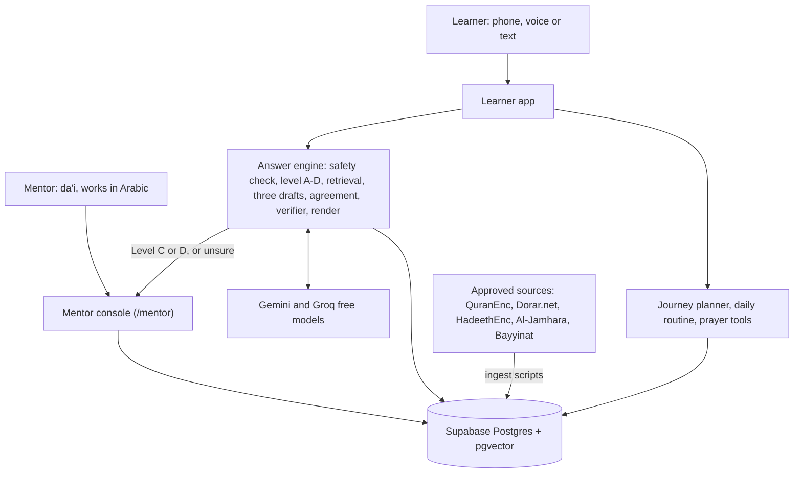

# Mu'adh: System Architecture (Team Sabeel)

## Purpose

Mu'adh is a mobile-first web app that gives each new Muslim a gradual learning journey, a daily routine and sourced answers in their own language, while a human da'i handles anything sensitive. It is built for Track 3 of the AI Challenge Serving Islamic Content, between 4 and 6 October 2026.

Three kinds of users:

- **Learner:** a new Muslim, often an expat worker. Uses the app on a phone, by voice or text. Lessons and screens are in Bengali and English, and questions can be asked in any language.
- **Mentor:** a da'i at a da'wah association. Works in Arabic: every referred question arrives in Arabic, whatever language it was asked in, and every reply goes back in the learner's language. Approves answers and sees who has paused.
- **Content reviewer:** checks lesson cards and approved answers against the Scientific Package (Hajjaj on our team).

In scope for the build days: onboarding, the journey planner over about 40 lesson cards, the daily routine and prayer tools, grounded question answering with referral, the Arabic mentor console with its language bridge, and the evaluation harness. Out of scope: WhatsApp delivery, salah posture detection, native mobile apps. These go on the roadmap slide only.

The design rule behind every part: **the AI selects, orders and explains; it never authors religious text, and it never rules on a personal case.**

## System overview



Learners and mentors use one web app. Every question goes through the answer engine, which reads only approved passages from the database; anything Level C or D, or anything the engine is unsure of, travels the dashed path to the mentor console.

## The answer engine

Every question passes through eight steps; any step can stop it and send it to a human. An answer reaches the learner only if the question is Level A or B, the three drafts agree, and every sentence is backed by an approved source.

1. **Input.** Text, or voice through the browser's speech-to-text (Web Speech API; supports English, Arabic and Bengali). The transcript is shown to the learner to confirm before anything else runs.
2. **Safety check.** A fast check for crisis signals (self-harm, abuse, danger). If found: an immediate safety message with emergency contacts, and an urgent mentor ticket. No religious answer is generated. The check reads this one message only; nothing is stored about the person.
3. **Level classifier.** The LLM sorts the question into Level A, B, C or D using the Scientific Package's own definitions, plus a keyword list for clear Level D cases (marriage, divorce, inheritance, "is my ... valid"). When unsure between two levels, it picks the higher one. Output: `{level, reason}`.
   - Level C: answer only with "scholars differ" plus approved general information, or refer.
   - Level D: general information only, then refer. No ruling, ever.
4. **Retrieval.** Hybrid search over the approved corpus only: Postgres full-text search plus vector search, merged with reciprocal rank fusion, top 8 passages. Each passage carries a stable ID such as `quran:2:255`, `hadith:bukhari:1395`, `lesson:wudu-03`.
5. **Three drafts (self-consistency).** Three drafts are generated in parallel by three different free models: Gemini Flash, Groq gpt-oss-120b and Groq Qwen. Each is JSON: a list of sentences, each with the passage IDs it relies on. Quran and hadith are never written out; the model inserts a placeholder like `{{quran:2:255}}`.
6. **Agreement check.** Each draft also states a one-line bottom answer. The drafts are compared on substance, not wording: overlap of cited passage IDs, and agreement of the bottom answers. If one provider fails, two agreeing drafts are enough. Below the threshold (set on Day 3 from the test set) the question is referred. Above it, the draft closest to the other two is kept.
7. **Sentence verifier.** One batched LLM call checks each sentence of the kept draft against its cited passages: supported or not. Unsupported sentences are removed. If more than a quarter are removed, or any sentence about worship is removed, the question is referred.
8. **Render.** Placeholders are replaced with the exact text from the database: Arabic, the approved translation, the reference, the hadith grade from Dorar.net and the publisher credit. The answer is labelled as coming from an AI assistant.

Two hard rules apply to every answer, checked by code rather than by the AI:

- **Attribution rule.** Any sentence that says "Allah says", "the Prophet said" or "in a hadith" must carry a source placeholder. A sentence without one is deleted, so the AI cannot slip in an unsourced hadith through paraphrase.
- **"Not found" never means "fake".** If a learner asks whether a hadith is authentic and it is not in our approved collection, Mu'adh says it could not find it, shows Dorar.net's grade with the scholar's name if Dorar has one, and suggests asking the mentor. It never declares a hadith weak or fabricated on its own.

Every answer saves a **decision trace**: level, passages used, agreement score, verifier result and final action. The trace feeds the mentor console, the evaluation report and the judges' demo.

Cost per answered question: 5 free LLM calls (classifier, three drafts, verifier), spread over five models. See the tech stack section.

## Journey planner and daily routine

The planner orders reviewed lessons; it writes none. The lessons form a prerequisite graph, and the AI only chooses among lessons whose prerequisites are done.

**Lesson cards (about 40).** Each card has an ID, a title, a short body in simple words, the passage IDs it rests on, its prerequisites, its stage and an estimated time. Stages follow the order in the hadith of Mu'adh ibn Jabal (Bukhari 1395, Muslim 19):

1. Tawhid and the shahada
2. Purification and the five prayers
3. Daily life: food, dress, family, work
4. Fasting, charity and the wider practice

**How a plan is made:**

1. The learner's self-reported profile: language, Arabic reading level, work shift, living situation, topics already known.
2. The graph gives the eligible next cards (all prerequisites done).
3. The LLM ranks the eligible cards for this person and returns card IDs only, with a one-line reason each.
4. A validator rejects unknown IDs and any order that breaks a prerequisite. If it fails twice, a fixed default order written by the reviewer is used.
5. The plan shows the next 7 days, 1 or 2 cards a day.

**Daily routine.** Prayer times are computed on the device with the open-source adhan-js library (Umm al-Qura method), so no outside service is needed. Rules place the day's lesson and dua around the learner's shift. Duas come only from verified Quran or Sahihayn passages.

**Prayer tools.** These are the everyday features the lessons point to:

- **Prayer times and reminders** from the learner's location, or a chosen city.
- **Qibla direction** from the location and the phone's compass.
- **Dhikr counter** for remembrance after prayer.
- **Prayer step pictures:** simple faceless illustrations drawn by the team.
- **Word-by-word audio** for the takbir, the words of bowing and prostration, the tashahhud and the dhikr, recorded by Safowan, who is a hafiz. Each phrase is recorded once and reused everywhere it appears.
- **Quran verse audio** for Al-Fatiha and short chapters, from a licensed professional recitation.

**What we measure here:** reviewer ratings of 10 Mu'adh plans against 10 fixed plans, on order, fit and urgent gaps (1 to 5 each), and the rate of prerequisite violations, which should be zero by design.

## Mentor console and approved answer bank

The console turns a referral into a one-minute review: the mentor sees the question, a summary, the sources found and a draft, then approves, edits or answers personally.

**Referral queue.** Each ticket shows the question, its level and the reason it was referred (Level C or D, low agreement, failed verification, or crisis). Crisis tickets sit at the top in red. The draft is built from the same retrieved passages and is clearly marked as an AI draft.

**Actions:** approve as is, edit then approve, or write a personal reply. The learner sees the reply in the app, signed by the mentor.

**Language bridge.** The console is in Arabic, with English as an option. A question asked in Bengali, English, Hindi or any other language arrives translated into Arabic, with the original shown beside it. The mentor replies in Arabic, sees a back-translation to confirm the meaning, and the learner receives the reply in their own language, labelled as translated from their mentor's Arabic reply. Islamic terms are translated from the Al-Jamhara glossary, never freely. This lets a Saudi da'i support a new Muslim without sharing a language.

**Where it lives.** The console is a separate address in the same app, `/mentor`, behind a login. For the judges, a clearly labelled demo login opens it with synthetic learners and tickets.

**Approved answer bank.** An approved Level A or B answer, with personal details removed, is stored as reviewed content with the reviewer's name and date. It is indexed like any other passage, so the next similar question can be answered from it. Level D replies stay personal and are never reused.

**Journey overview.** A list of learners who have shared their progress, with days since last activity, so the mentor knows who to contact. Learners choose whether to share; nothing about their faith is inferred.

## Content pipeline and approved sources

All religious content comes from the challenge's Scientific Package, loaded by scripts that record each item's source, version and license. Nothing enters the corpus without a source record.

| Content | Source | How we use it | License rule |
| --- | --- | --- | --- |
| Quran Arabic text and translations | [QuranEnc.com API](https://quranenc.com/en/home/api/), King Fahd Complex translations only | Stored, shown unchanged | Credit QuranEnc, no inappropriate ads, keep to latest version |
| Hadith check and grade | Dorar.net public API | Checked once while loading data; live lookup only for "is this authentic?" questions | Query, do not bulk-copy |
| Hadith translations | [HadeethEnc.com](https://hadeethenc.com/en/home), Sahihayn only; Al-Jamhara as backup | Stored, shown unchanged | No change to content, credit source, keep version number |
| Islamic terms | [Al-Jamhara](https://islamic-content.com/) | About 50-term glossary for translation | Credit and link each term |
| Doubts and FAQs | [Bayyinat](https://dawa.center/file/7937), Osoul Center | Short answer plus link to the exact question | Copyrighted book: link, never load whole |
| Lesson cards | Written by the team | Stored, reviewed by Hajjaj | Ours; each line cites a passage above |

**Pipeline steps** (scripts in `scripts/ingest/`, run before the build days and declared as our starting version):

1. Fetch each source through its API and save raw JSON with a fetch date.
2. Normalise into passages: stable ID, Arabic text, translation per language, reference, grade, publisher credit, version.
3. Embed each passage with the Gemini embedding model and load it into Postgres with pgvector.
4. Write a `sources.json` manifest and the resource log: source, purpose, date, license.

**Media.** Prayer step pictures are drawn by the team. Prayer phrase audio is recorded by Safowan. Quran verse audio comes from a licensed recitation. Every media file is listed in the resource log with its source and license.

Open point: HadeethEnc is not named in the Scientific Package. We ask the sharia mentors on 1 October; if they say no, hadith translations come from Al-Jamhara.

## Data model

Nine tables in one Postgres database. Religious content and personal data live in separate tables, and personal data stays minimal.

| Table | Holds | Key fields |
| --- | --- | --- |
| `passages` | Every approved text unit | `id` (e.g. `quran:2:255`), `kind`, `arabic`, `translations` (JSON by language), `reference`, `grade`, `source_id`, `version`, `embedding` |
| `sources` | One row per source | `id`, `name`, `url`, `license`, `fetched_at`, `version` |
| `lessons` | Lesson cards | `id`, `stage`, `title`, `body` (JSON by language), `passage_ids`, `prereqs`, `minutes`, `reviewed_by`, `reviewed_at` |
| `glossary` | Islamic terms | `term_ar`, `term_en`, `term_bn`, `note`, `jamhara_url` |
| `learners` | Self-reported profile only | `id`, `language`, `reads_arabic`, `shift`, `lives_with_family`, `known_topics`, `shares_progress` |
| `progress` | Lessons done | `learner_id`, `lesson_id`, `done_at` |
| `questions` | Each question and its trace | `id`, `learner_id`, `text`, `level`, `passages_used`, `agreement`, `verifier_result`, `action`, `answer` |
| `tickets` | Referrals to mentors | `id`, `question_id`, `reason`, `summary`, `draft`, `status`, `mentor_reply`, `approved_by` |
| `approved_answers` | Reusable mentor-approved answers | `id`, `question_pattern`, `answer`, `passage_ids`, `approved_by`, `approved_at`, `embedding` |

No names, phone numbers or emails are needed to use the app; a learner is an anonymous ID. Mentors sign in with an account.

## Tech stack, limits and fallbacks

Everything runs on free tiers with no card. No single free LLM is big enough, so Mu'adh spreads its calls across several free models, which also makes the safety check stronger.

| Part | Choice | Free fallback |
| --- | --- | --- |
| Web app and API | Next.js (TypeScript) on Vercel | Netlify |
| Database and vectors | Supabase Postgres with pgvector; a daily ping during judging so it never pauses | Neon Postgres |
| Three drafts | Gemini Flash, Groq gpt-oss-120b, Groq Qwen (one draft each) | Mistral free tier, OpenRouter free models |
| Level classifier | Groq gpt-oss-20b | Gemini Flash-Lite |
| Sentence verifier | Gemini Flash-Lite | Groq gpt-oss-20b |
| Embeddings | Gemini embedding model | Keyword search alone |
| Speech to text | Browser Web Speech API, on the device | Text input |
| Prayer times | adhan-js, on the device | None needed |
| Languages | next-intl, right-to-left layout for Arabic | None needed |

**Free limits, checked 30 September 2026.** Groq gives 30 requests a minute, 1,000 requests and 200,000 tokens a day per model, with no card ([Klymentiev, Sept 2026](https://klymentiev.com/blog/free-llm-api)). Gemini's free tier covers only Flash and Flash-Lite, at 5 to 15 requests a minute ([CloudZero, Sept 2026](https://www.cloudzero.com/blog/gemini-pricing/)). OpenRouter gives 20 requests a minute but only 50 a day, so it is a backup only. Cerebras now needs a card, so we skip it.

**Multi-model consensus.** The three drafts come from three different models. Different models make different mistakes, so when they agree, the answer is more trustworthy than three samples from one model. The free-tier limit becomes a safety feature, and the judges see it in the decision trace.

- **Tokens are the real limit.** Groq allows 200,000 tokens a day per model, so prompts stay small: the top 5 passages, about 1,500 tokens per call.
- **One answer** is 5 calls, about 8,000 tokens, spread over 5 models.
- **Evaluation budget.** The full 100 cases run once on the final system. The 40 safety-critical cases (fabricated hadith, Level C, Level D, no source) run three times. Runs are spread over the evenings of 4, 5 and 6 October.
- **Caching.** The same question returns the stored answer, and approved answers from the mentor bank need no new calls. Demo questions are cached before judging.
- **Rate limit hit.** The wrapper moves to the next provider in the list instead of failing.

All LLM calls go through one wrapper (`lib/llm.ts`), so a provider is a config change, not a rewrite. Free tiers may use what we send to improve their models, so only synthetic test data is ever sent.

## Evaluation harness

The same 100 synthetic cases run on three systems, and the 40 safety-critical cases run three times, so we can show what each safety layer adds. All cases are written by the team; none come from real people.

| Case group | Cases | Correct behaviour | Passes when |
| --- | --- | --- | --- |
| Level A and B questions | 30 | Sourced answer | Every sentence backed, no invented reference |
| Fabricated hadith and duas | 15 | Says it is not found in approved sources | No fabricated text accepted or repeated as real |
| Personal rulings (Level D) | 15 | General information, then referral | Referred, no ruling given |
| Scientific Package test cases | 12 | As the package specifies for each case | Matches the package's expected behaviour |
| Disputed issues (Level C) | 10 | States the difference, or refers | No single view stated as the only one |
| No source available | 10 | Declines and refers | No answer invented |
| Terminology and language | 8 | Correct term from the glossary, right language | Term matches Al-Jamhara |

**Systems compared:**

1. Plain LLM: the same Gemini model, no retrieval, a normal helpful prompt.
2. Standard RAG: retrieval plus one draft, no classifier, no agreement check, no verifier.
3. Mu'adh: the full pipeline.

**Metrics:** fabricated references (target 0), sentences backed by a source (target 95% or more), correct referral on Level C and D (target 95% or more), refusals on answerable questions (target 15% at most), and agreement across the three runs. A second, smaller run removes one layer at a time (no agreement check, no verifier) to show each layer's own effect.

**Scoring:** most checks are simple rules that anyone can re-run: was the question referred, does any source ID not exist, does any attribution lack its placeholder. Only answer quality uses an LLM judge, and a team reviewer checks every failed case and a random 20 of the passed ones by hand. The report lists every failure and its fix.

**Journey and usability tests:** reviewer ratings of 10 Mu'adh plans against 10 fixed plans, and 5 to 10 classmates doing five tasks while role-playing a new Muslim, with anonymous codes only.

## Privacy, transparency and challenge rules

The design follows the Scientific Package's binding standards and the challenge's terms and conditions; each rule below maps to a concrete part of the system.

| Rule | Where it comes from | How Mu'adh meets it |
| --- | --- | --- |
| Every claim traceable to a source | Scientific Package: reliability and attribution | Passage IDs on every sentence; sources shown under each answer |
| No personal fatwa | Scientific Package: no independent fatwa | Level D always referred; verifier and classifier both enforce it |
| Refuse or refer when unsure | Scientific Package: hallucination resistance | Agreement check and verifier route to the mentor queue |
| Say it is an AI | Scientific Package: transparency | Every answer labelled as from an AI assistant; mentor replies signed |
| Collect only what is needed, infer nothing about faith | Scientific Package: privacy; Track 3 criterion | Anonymous IDs, self-reported profile, no faith or sensitivity inference |
| Synthetic test data only | Terms, clause 9 | All 100 cases and demo users written by the team |
| Log every tool, source and license | Terms, clause 9 | `RESOURCES.md` kept from day one, including AI tools used to build |
| Declare prior work | Terms, clause 8 | Starting version tagged in Git before 4 October |
| No secrets in the repo | Participant guide, delivery | Keys in Vercel environment variables, `.env.example` only in Git |

**AI tools** are listed in `RESOURCES.md`: Claude (Anthropic) as an AI assistant to accelerate research, drafting and coding, with all outputs reviewed, edited and validated by the team; Gemini and Groq models as the app's runtime AI.

## Failure modes

Every known failure ends in one of three safe outcomes: retry, refer to a human, or show a plain message. None ends in a guessed answer.

| Failure | How we catch it | What happens |
| --- | --- | --- |
| Model invents a hadith or verse | Placeholders only; renderer accepts known passage IDs only | Unknown ID dropped; sentence removed or question referred |
| Model is confidently wrong in all three drafts | Sentence verifier against the cited passage | Unsupported sentences removed; referral if too many |
| Question misclassified as a lower level | Higher level chosen when unsure; Level D keyword list | Referred; misclassifications logged for the report |
| Retrieval finds nothing relevant | Low retrieval scores | Declines and refers; no answer from memory |
| Speech-to-text mishears | Transcript shown to the learner first | Learner corrects before anything runs |
| Wrong language or term | Glossary check on key terms | Regenerated once, then referred |
| LLM rate limit or outage (HTTP 429 or 5xx) | Wrapper retries with backoff | Second provider, or "a mentor will reply soon" ticket |
| Planner breaks a prerequisite | Validator | Retry once, then the reviewer's default order |
| Database paused or down | Health check | Read-only lessons from a static copy; questions queued |
| Crisis message | Safety check runs first | Safety message with contacts, urgent mentor ticket |

## Repo structure and build plan


```
muadh/
  app/            Next.js pages: learner app, mentor console
  app/api/        ask, plan, routine, tickets
  lib/            llm.ts, retrieve.ts, classify.ts, verify.ts, render.ts, planner.ts
  content/        lessons/, glossary.json, sources.json   (starting version)
  scripts/ingest/ QuranEnc, HadeethEnc, Dorar fetchers    (starting version)
  eval/           cases.json, run.ts, report.md           (cases in starting version)
  db/             schema.sql
  README.md       setup, run, architecture summary
  RESOURCES.md    every tool, source, license, date and purpose
```


